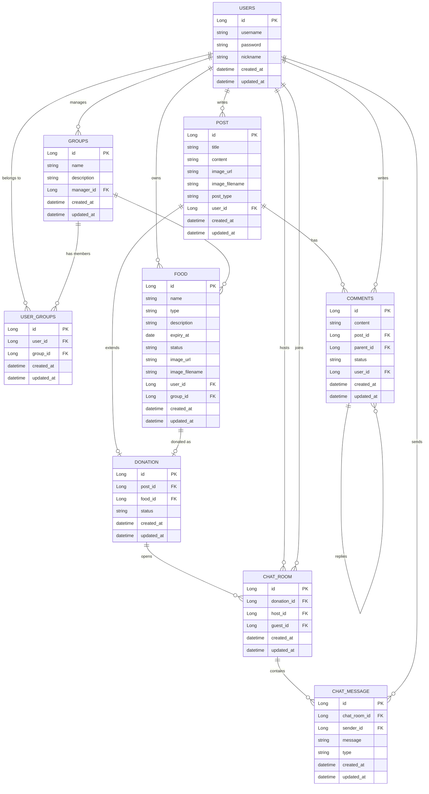

# Food Guard 2


# Introduction

Food Guard 2는 Food Guard의 백엔드 구조를 **Spring Boot 기반으로 다시 설계**한 프로젝트입니다. 현 직장의 레거시 코드를 분석하며, 가져올 것은 가져오고 개선할 점은 개선하기위해 시작되었습니다.
이번 프로젝트는 기능 하나하나에 초점을 맞추기보다는 **전체적인 구조적 문제점을 해결하는 것**에 초점을 두었습니다.

# Key Improvements - (Architecture)

기존 [Food Guard 1](https://github.com/DNA-B/Food-Guard)을 진행하면서 생각했던 개선점들을 이번 프로젝트에 반영해보았습니다.

- **DB 명세서의 부재**
  - 테이블의 각 필드에 대한 설명이 없기 때문에 프로젝트가 거대해질 수록 데이터베이스 파악이 힘들어집니다. 이에 대한 해결책으로 Entity를 생성할 때 각 필드에 **`comment` 속성**을 작성하여 Entity 생성시점에 DB 명세를 같이 생성할 수 있도록 하였습니다.
  - 추후 여러가지 이유로 인해 `comment`의 누락이 발생할 수도 있기 때문에 **Reflection**을 사용하여 **글로벌 테스트 코드**를 작성하였습니다. **Github Actions**를 통해 PR을 merge하기 전에 모든 테스트를 통과해야 하기 때문에 `comment` 속성이 누락된 경우 merge를 할 수 없게 됩니다. 해당 방법으로 **DB 명세 작성을 강제**했습니다.

- **API 명세서의 부재**
  - 솔루션 회사는 고객사마다 커스텀된 코드를 생성하는 경우가 존재합니다. 각 고객사마다 어떤 기능을 갖고 있는지 확인할 수 있는 명세서가 없다면 이미 존재하는 기능을 새로 만들어내는 비효율적인 상황이 발생할 수 있습니다.
  - 이런 상황을 방지하기 위해서 **Swagger**를 사용하여 **API 명세서를 생성**하도록 하였습니다. Swagger를 통해 각 고객사의 API 명세를 확인할 수 있다면, **인수인계나 신입 사원의 온보딩**에도 큰 도움이 될 것이라고 생각했습니다.

- **테스트의 부재**
  - 솔루션 회사의 경우 공통 레포지토리를 fork해서 고객사 전용 레포지토리를 따로 생성하는 경우가 있습니다. 이 경우 공통 레포지토리에 오류를 생성하는 코드가 존재할 경우 fork된 고객사 레포지토리에도 똑같은 오류가 발생합니다. 이 경우 같은 문제를 계속해서 유지보수해야하는 상황이 발생합니다.
  - 이를 방지하기 위해서 **유닛 테스트 코드를 작성**하였습니다. 공통 레포지토리의 오류를 유닛 테스트로 확인함으로써 fork시에 오류가 같이 옮겨가지 못하게 방지하고자 하였습니다.
  - 단순히 유닛 테스트 코드를 작성하기만한다면 테스트 실패를 무시하고 Push하는 경우가 생길 수도 있습니다. **Github Actions**를 사용하여 PR을 생성하고 merge 하기 위해서 **build가 통과해야 가능하도록 설정**하였습니다.

- **Redis Pub/Sub 기반 Multi-Instance WebSocket 메시지 브로커 구축**
  - 기존 [Food Guard 1](https://github.com/DNA-B/Food-Guard)은 **단일 서버 환경**만 고려되어 있어, 서버가 여러 대로 확장될 경우 서로 다른 서버에 접속한 유저 간 **실시간 채팅 메시지가 동기화되지 않는 한계**가 있었습니다.
  - 이를 해결하기 위해 **Redis의 Pub/Sub(발행/구독)** 구조를 메시지 브로커로 도입하였습니다.
  - 특정 서버로 수신된 웹소켓 메시지를 Redis 채널에 **Publish** 하면, 모든 서버 인스턴스가 이를 **Subscribe** 하여 자신이 보유한 웹소켓 세션의 유저에게 메시지를 전파하도록 구조를 개선하였습니다.

# Key Improvements - (Features)

- **QueryDSL 적용**
  - 졸업프로젝트인 [DAY-J](https://github.com/DAY-J)에서 **N+1 문제**로 인해 Join 쿼리의 속도가 매우 느렸습니다. 이번 프로젝트에서는 **QueryDSL**을 사용하여 **Fetch Join**을 통해 N+1 문제를 해결하였습니다.

# ERD



# Preview

Food Guard 2는 백엔드 개선 프로젝트이므로 별도의 프론트엔드 화면을 포함하지 않습니다.

프론트엔드 화면과 기존 서비스 흐름은 Food Guard 1 저장소에서 확인할 수 있습니다.

[Food Guard 1 Repository](https://github.com/DNA-B/Food-Guard)

Swagger UI를 통해 Food Guard 2의 API 명세를 확인할 수 있습니다.

```text
http://localhost:8080/swagger-ui/index.html
```

OpenAPI JSON 문서는 아래 파일에도 보관되어 있습니다.

```text
docs/api-docs.json
```

# How to Run

`.env.example`을 참고해 프로젝트 루트에 `.env` 파일을 생성합니다.

```env
POSTGRES_PORT=5432
POSTGRES_USER=your_username
POSTGRES_PASSWORD=your_password
POSTGRES_DB=your_database_name
DB_URL=jdbc:postgresql://localhost:5432/your_database_name

JWT_SECRET=your_jwt_secret
JWT_EXPIRATION_TIME=3600000
```

PostgreSQL과 Redis를 실행합니다.

```bash
docker compose up -d
```

애플리케이션을 실행합니다.

```bash
./gradlew.bat bootRun
```

테스트를 실행합니다.

```bash
./gradlew.bat test
```

---

### Project Timeline

- `2026.04` ~ `2026.07`
  - Food-Guard Backend Upgrade & Migration
