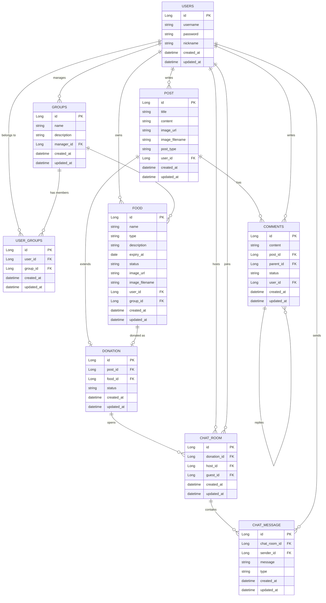

# Food Guard 2


# Introduction

Food Guard 2는 Food Guard의 백엔드 구조를 Spring Boot 기반으로 다시 설계한 프로젝트입니다.

기존 회사 레거시 코드를 보며 DB 명세서 부재, 불명확한 테이블 관계, API 명세 공유의 어려움, 테스트 부재로 인한 반복 유지보수 문제를 경험했습니다. Food Guard 2에서는 이 문제들을 기능 구현 이후에 보완하는 것이 아니라, 프로젝트 구조 안에서 지속적으로 관리되도록 만드는 데 초점을 두었습니다.

DB 명세서는 Entity 컬럼의 `comment` 속성으로 관리하고, reflection 기반 전역 테스트로 comment 누락을 검증합니다. 테이블 관계는 JPA 연관관계와 FK 선언으로 코드상에서 명확히 드러내되, 운영 성능 부담을 줄이기 위해 물리 FK 제약은 생성하지 않도록 설계했습니다.

API 명세는 Swagger를 통해 공유할 수 있도록 구성했고, Auth, User, Food, Donation, Group, Post, Comment, Chat 등 주요 Service 계층에 대한 유닛 테스트를 작성해 반복되는 오류를 사전에 발견할 수 있도록 했습니다.

# ERD



# Preview

Food Guard 2는 백엔드 개선 프로젝트이므로 별도의 프론트엔드 화면을 포함하지 않습니다.

프론트엔드 화면과 기존 서비스 흐름은 Food Guard 1 저장소에서 확인할 수 있습니다.

[Food Guard 1 Repository](https://github.com/DNA-B/Food-Guard)

Swagger UI를 통해 Food Guard 2의 API 명세를 확인할 수 있습니다.

```text
http://localhost:8080/swagger-ui/index.html
```

OpenAPI JSON 문서는 아래 파일에도 보관되어 있습니다.

```text
docs/api-docs.json
```

# How to Run

`.env.example`을 참고해 프로젝트 루트에 `.env` 파일을 생성합니다.

```env
POSTGRES_PORT=5432
POSTGRES_USER=your_username
POSTGRES_PASSWORD=your_password
POSTGRES_DB=your_database_name
DB_URL=jdbc:postgresql://localhost:5432/your_database_name

JWT_SECRET=your_jwt_secret
JWT_EXPIRATION_TIME=3600000
```

PostgreSQL과 Redis를 실행합니다.

```bash
docker compose up -d
```

애플리케이션을 실행합니다.

```bash
./gradlew.bat bootRun
```

테스트를 실행합니다.

```bash
./gradlew.bat test
```

* * *

### Project Timeline

  * `2026.04` ~ `2026.07`
    * Backend Upgrade & Migration
    * DB 명세 자동화를 위한 Entity comment 및 reflection 기반 전역 테스트 적용
    * 물리 FK 제약 없이 코드상 테이블 관계를 추적할 수 있도록 JPA 연관관계 정리
    * Swagger 기반 API 명세 공유 환경 구성
    * Service 계층 유닛 테스트 작성으로 반복 유지보수 오류 예방
